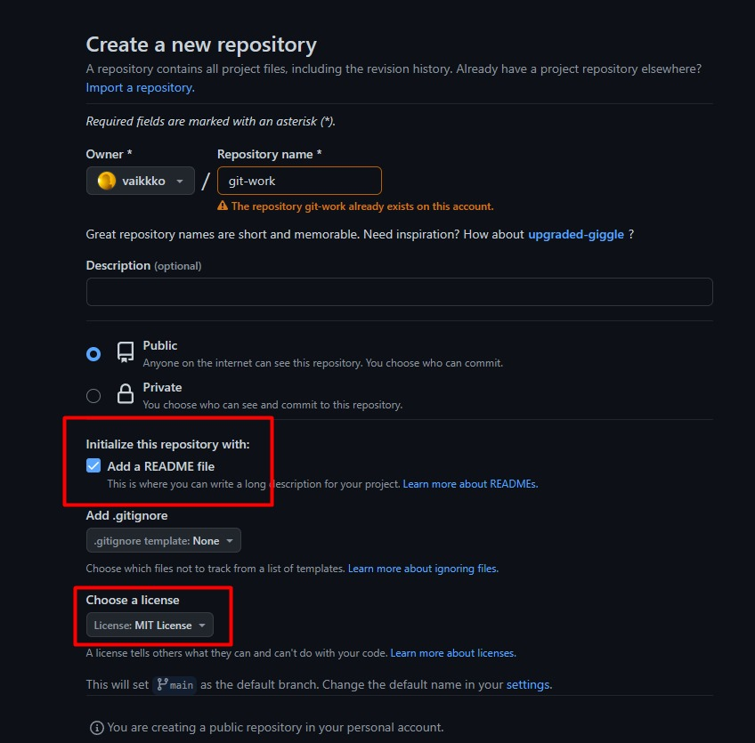
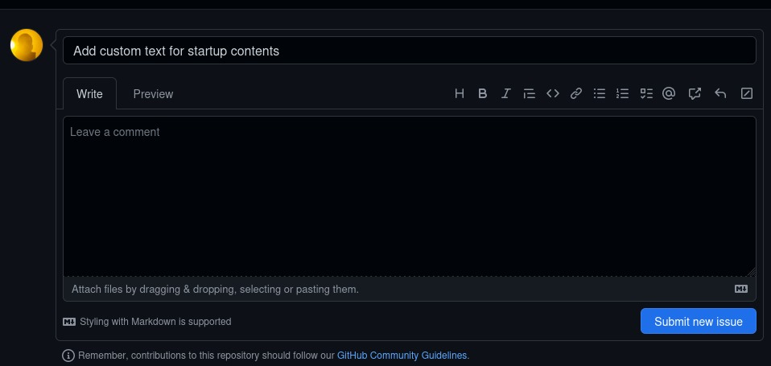
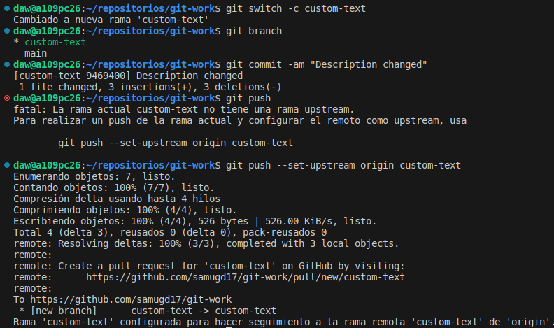
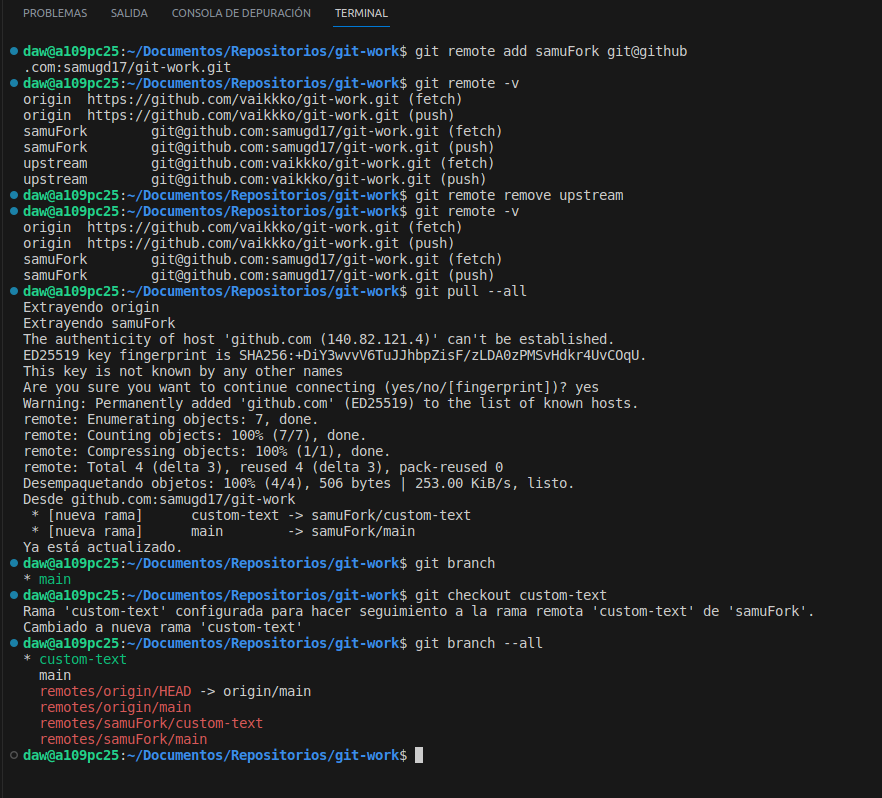
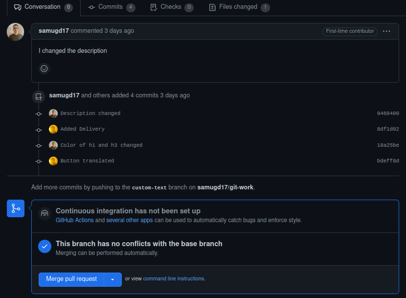
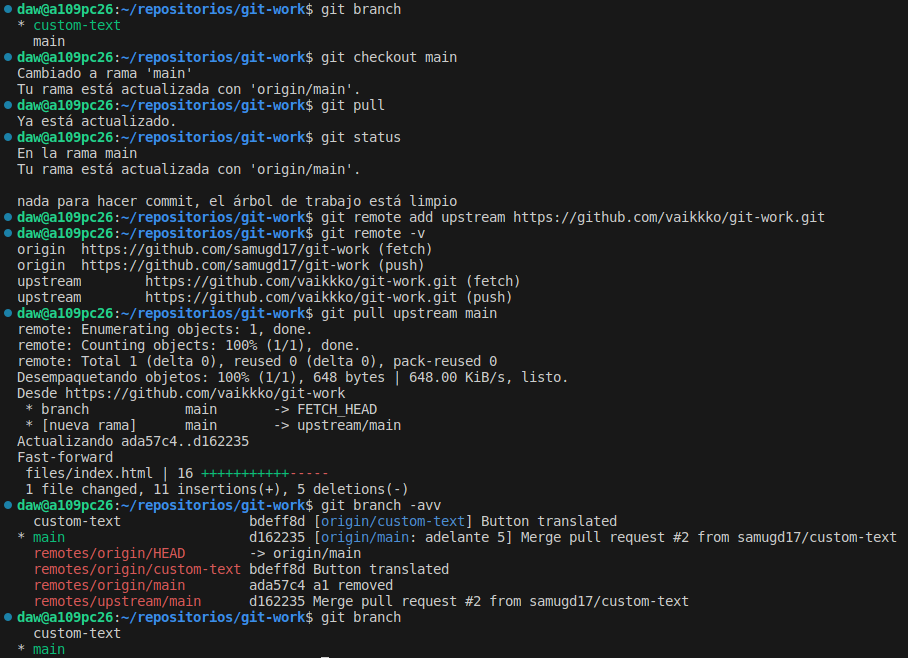
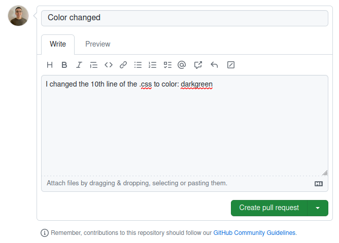
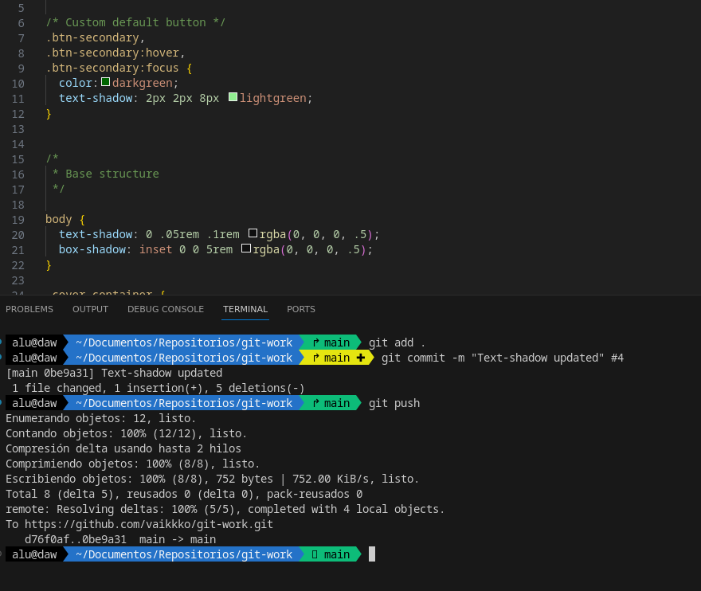
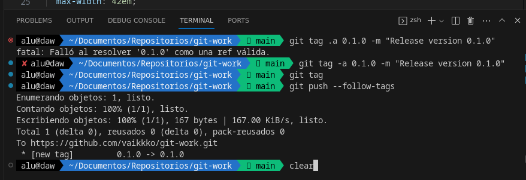

# UT1-A1 Documentación y sistema de control de versiones

***Nombre:*** Victor Manuel Martínez López y Samuel Eloy González Díaz.

***Curso:*** 2º de Ciclo Superior de Desarrollo de Aplicaciones Web.

### ÍNDICE

+ [Introducción](#id1)
+ [Objetivos](#id2)
+ [Material empleado](#id3)
+ [Desarrollo](#id4)
+ [Conclusiones](#id5)

#### ***Introducción***. 

En esta tarea, aprenderemos a usar Github orientado al trabajo en equipo, así como sus principales comandos y utilidades. Todo esto, siguiendo el siguiente esquema:

#### ***Objetivos***. 

El objetivo de esta práctica es recordar o adquirir los conocimientos necesarios para podere trabajar en equipo de forma remota de la mejor forma posible a través de Github.

#### ***Material empleado***. 

Para realizar esta práctica tan sólo necesitaremos dos equipos y dos cuentas con acceso a Github. También emplearemos el programa Visual Studio Code para realizar la documentación de la tarea.

#### ***Desarrollo***. 

__User 1:__ Victor

__User 2:__ Samuel

1. En primer lugar, Victor (user1 a partir de ahora), crea un repositorio público llamado git-work en su cuenta de GitHub, añadiendo un README.md y una licencia MIT. Este paso puede ser realizado a través de comandos mediante _git init_, pero nosotros hemos decidido inicializarlo a través de la web de Github.

_La imagen ha sido tomada después de haber creado el repositorio, de ahí el aviso por repositorio ya existente._

2. User1 clonará el repo y añadirá los ficheros: index.html, bootstrap.min.css y cover.css. Luego subirá los cambios al upstream.

3. En este punto, Samuel (a partir de ahora, user 2) crea un fork de git-work desde su cuenta de GitHub y lo clona en su local, para de esta forma poder empezar a trabajar sobre él sin necesidad de tener acceso al repositorio original de user1. La clonación, tal y como vimos en el paso anterior se realiza siguiendo el mismo procedimiento.

4. User1 crea una issue con el título "Add custom text for startup contents" a través del cliente web de Github.

5. User 2, al percatarse de la existencia de este issue, crea una nueva rama _"custom-text"_ en su repositorio local mediante el comando _"git switch -c"_, que permite crear una nueva rama y situarse sobre ella, y modifica el fichero index.html personalizándolo para una supuesta startup, cambiando la descripción de index.html. Finalmente realiza el push configurando esta rama como remota y envía un pull request mediante Github a user1 para que compruebe los cambios realizados.

6. Una vez hecho esto, user1 probará el PR de user2  en su máquina (copia local) creando previamente un remoto denominado samuFork mediante  el comando _"git remote add samuFork git@github.com:samugd17/git-work.git"_. Seguidamente, mediante _"git remote -v"_ se comprueban los remotos existentes y se borran los innecesarios a través de _"git remote remove"_. Una vez hecho esto ya sólo queda hacer un _"git pull"_ del resto y realizar ciertos cambios en su copia local que luego deberá subir al propio pull request.

7. Acto seguido, user1  y user2  tendrán una pequeña conversación en la página del PR, donde cada usuario incluirá, al menos, un cambio más. En este caso, user1 ha añadido un botón más a la barra de navegación ("Delivery"), luego user2 ha cambiado los colores de h1 y h3 en el archivo .css y por último user1 ha traducido al español el botón principal de la página.

    Teniendo todo estos cambios realizados y estando el user1 de acuerdo con todos ellos procedo a realizar el merge del pull request.

8. Ahora, user2  deberá incorporar los cambios de la rama principal de upstream en su propia rama principal. Para ello primero debe situarse sobre su rama main, añadir la rama remota de user 1 (_"git remote add upstream https://github.com/vaikkko/git-work.git"_) y traérsela mediante el pull.

9. Tal y como se hizo anteriormente, user1  creará una nueva issue con el título "Improve UX with cool colors". Además, cambiará la línea 10 de cover.css a:

        color: purple;

    Hecho esto, simplemente se realizará un commit local en main, no se realizará el push. 

10. User2  creará una nueva rama cool-colors y cambiará la línea 10 de cover.css a:

        color: darkgreen;

    Una vez finalizado, enviará un pull request a user1 con ese cambio.

11. User1  probará el PR de user2  (en su copia local), y realizará un merge del contenido de la rama cool-colors en su rama principal. Esto generará un conflicto que tendrá que gestionar dejando el contenido proveniente de user2.

En este caso, user1 optará por aceptar el cambio entrante realizado por user2 a través de la interfaz de visual studio code, tal y como se muestra en la siguiente imagen.

Utilizando el comando git log, observamos que se ejecuta el merge con el siguiente mensaje "PR Accepted from Samu".

12. Después del commit para arreglar el conflicto, user1  modificará la línea 11 de cover.css a:

        text-shadow: 2px 2px 8px lightgreen;

    y hará un commit especificando en el mensaje el cambio hecho haciendo referencia a la issue creada. A continuación subirá los cambios a origin/main.

13. Finalmente, user1  etiquetará esta versión (en su copia local) como 0.1.0 y después de subir los cambios creará una "release" en GitHub apuntando a esta etiqueta.

#### ***Conclusiones***. 

Esta práctica nos ha hecho ver muchas posibilidades y funcionalidades que ofrece Github para el trabajo en equipo, aún sin estar éste definido previamente. Ya que podemos trabajar tanto con ramas diferentes en un mismo proyecto, como realizar un fork de otro repositorio y aportar nuestras ideas y conocimientos a una persona totalmente ajena a nosotros. Aún nos queda trabajo por delante para poder dominar totalmente toda la potencia de Github y poder eliminar algunos probelmas que hemos tenido durante la práctica, pero en general, ha sido una práctica muy enriquecedora.

